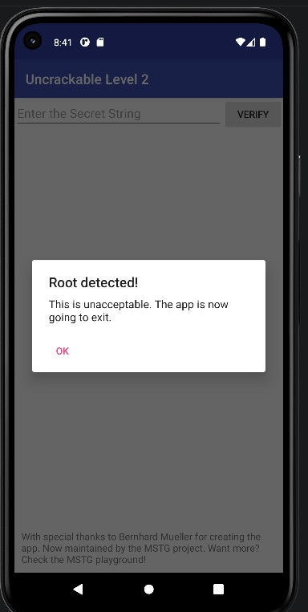
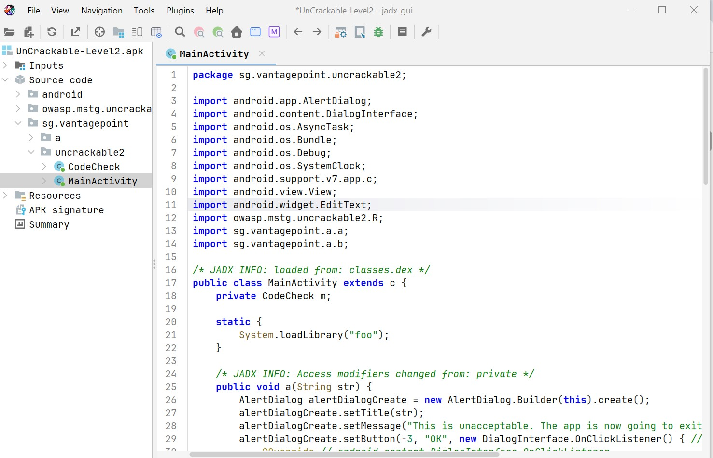
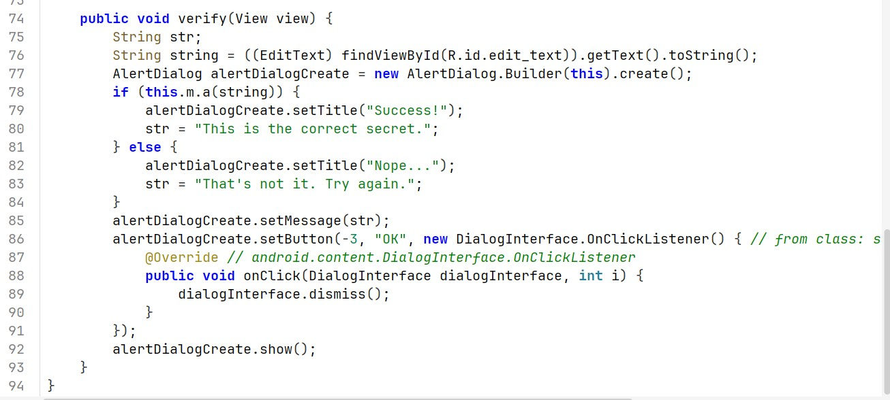
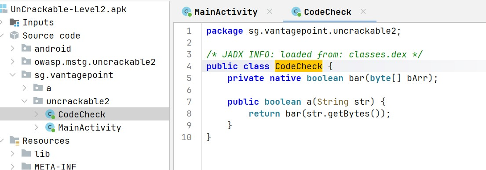
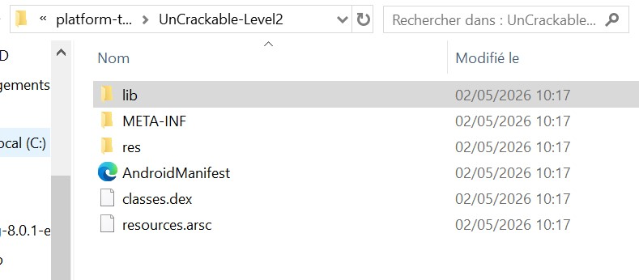
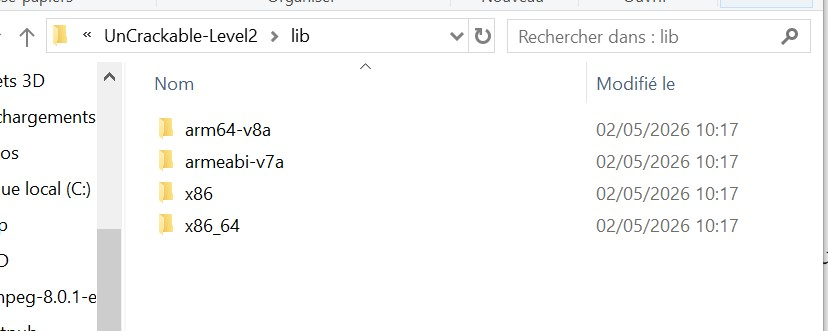
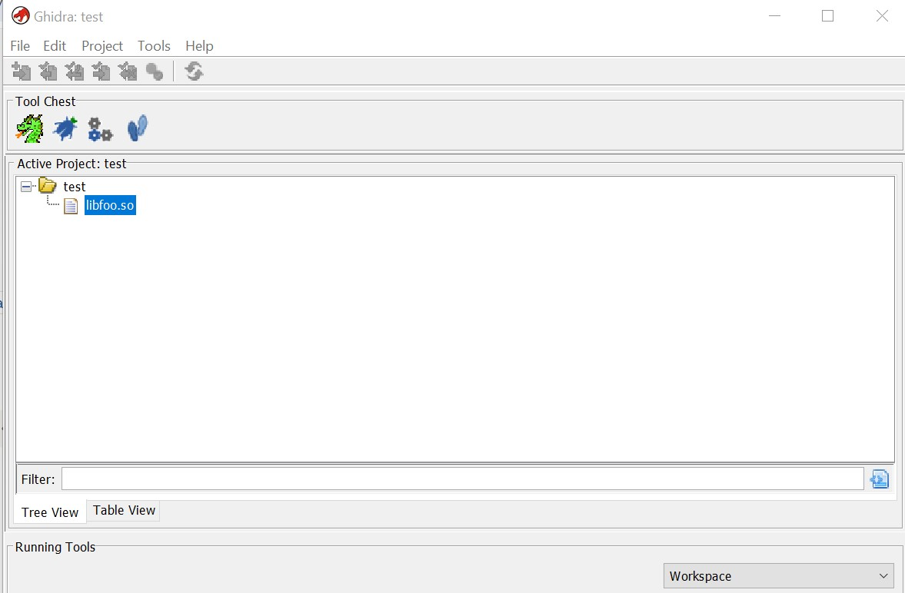
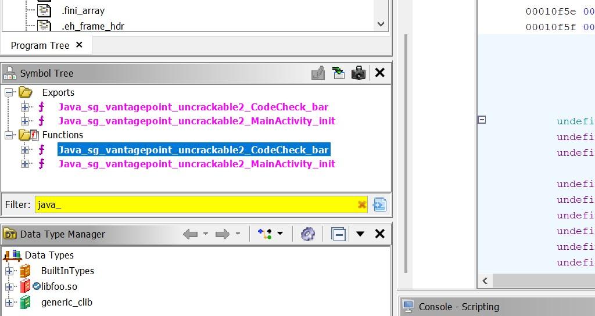
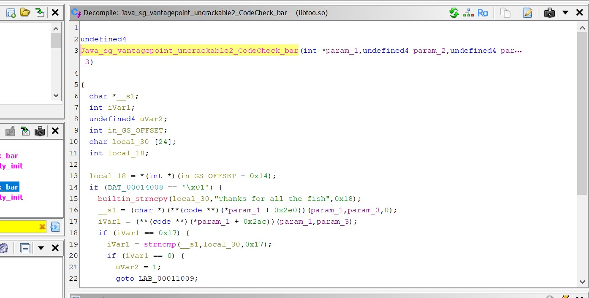
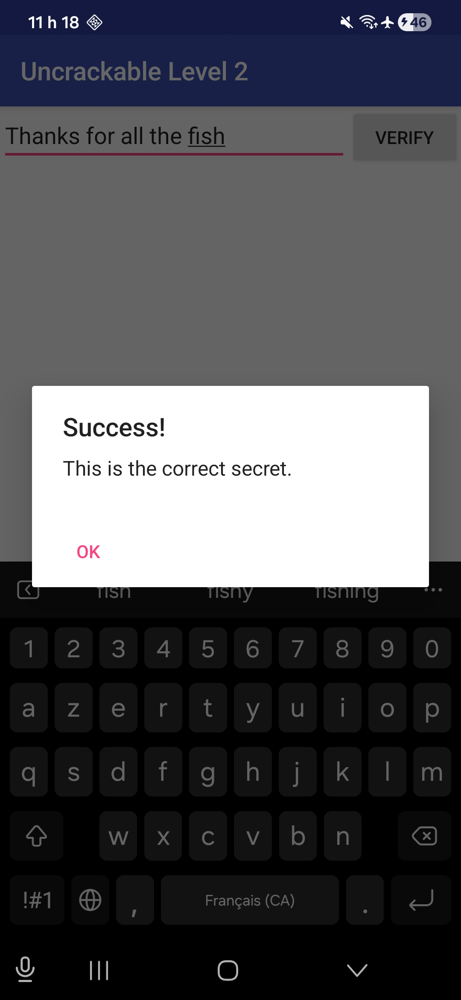

# LAB 5 — Reverse Engineering : UnCrackable Level 2

## Objectif

Analyser une application Android qui cache sa logique de vérification dans une bibliothèque native (`.so`), et retrouver le secret caché en utilisant JADX et Ghidra.

---

## Outils utilisés

- Android Studio (émulateur + téléphone physique)
- `adb` (Android Debug Bridge)
- JADX-GUI (décompilateur Java)
- Ghidra (désassembleur / décompilateur natif)

---

## Partie 1 — Analyse Dynamique

### Étape 1 : Installation et observation de l'interface

L'APK est installé via `adb` sur un téléphone Android physique :

```bash
.\adb install UnCrackable-Level2.apk
```

Au lancement, l'application affiche une interface simple avec un champ de saisie et un bouton **VERIFY**. Sur l'émulateur, une popup "Root detected!" apparaît immédiatement — l'application vérifie l'intégrité de l'environnement.



---

## Partie 2 — Analyse Statique avec JADX

### Étape 2 : Décompilation de l'APK

L'APK est ouvert dans JADX-GUI. L'arborescence révèle le package `sg.vantagepoint.uncrackable2` contenant les classes `MainActivity` et `CodeCheck`.

On remarque dès `MainActivity` un appel à `System.loadLibrary("foo")` — première indication que la logique critique est dans une bibliothèque native.



### Étape 3 : Flux de vérification dans MainActivity

En analysant la méthode `verify`, on voit que l'application récupère la saisie utilisateur et appelle `this.m.a(string)`. Si la vérification réussit → `"Success!"`, sinon → `"Nope..."`.



### Étape 4 : La classe CodeCheck — pont vers le code natif

La classe `CodeCheck` contient la logique de vérification. La méthode `a()` ne fait que transmettre la chaîne à une méthode déclarée `native` nommée `bar`. Le mot-clé `native` signifie que le code réel est implémenté en C/C++ dans un fichier `.so`.

```java
public class CodeCheck {
    private native boolean bar(byte[] bArr);

    public boolean a(String str) {
        return bar(str.getBytes());
    }
}
```



---

## Partie 3 — Extraction de la bibliothèque native

### Étape 5 : Extraction du contenu de l'APK

Un APK est simplement un fichier ZIP. En le renommant et l'extrayant, on accède à son contenu. Le dossier `lib/` contient plusieurs variantes de `libfoo.so` selon l'architecture.





---

## Partie 4 — Analyse du code natif avec Ghidra

### Étape 6 : Import de libfoo.so dans Ghidra

Le fichier `libfoo.so` (architecture x86) est importé dans Ghidra. Après analyse automatique, le projet affiche les fonctions exportées.



### Étape 7 : Localisation de la fonction JNI

Dans la **Symbol Tree**, en filtrant sur `java_`, on retrouve la fonction JNI correspondant à la méthode `bar` de Java :

```
Java_sg_vantagepoint_uncrackable2_CodeCheck_bar
```



### Étape 8 : Lecture du pseudo-code décompilé

Le décompilateur Ghidra révèle la logique complète. La chaîne secrète est copiée en clair dans une variable locale :

```c
builtin_strncpy(local_30, "Thanks for all the fish", 0x18);
```

Puis comparée à l'entrée utilisateur via `strncmp` sur 0x17 (23) caractères :

```c
iVar1 = strncmp(__s1, local_30, 0x17);
if (iVar1 == 0) { /* succès */ }
```

Le secret est donc stocké **en clair** dans la bibliothèque native.



---

## Partie 5 — Validation

### Étape 9 : Saisie du secret dans l'application

En saisissant la chaîne identifiée dans le binaire, l'application affiche **"Success! This is the correct secret."**

```
Thanks for all the fish
```



---

## Conclusion

Ce lab illustre un mécanisme courant en sécurité mobile : déplacer la logique sensible du code Java vers du code natif via JNI pour compliquer l'analyse. Malgré cela, un décompilateur natif comme Ghidra permet de reconstruire le pseudo-code et d'extraire le secret.

Le chemin d'analyse suivi :

```
MainActivity.verify()
    → CodeCheck.a()
        → CodeCheck.bar()  [native]
            → libfoo.so
                → strncmp(input, "Thanks for all the fish")
```

**Secret final : `Thanks for all the fish`**
